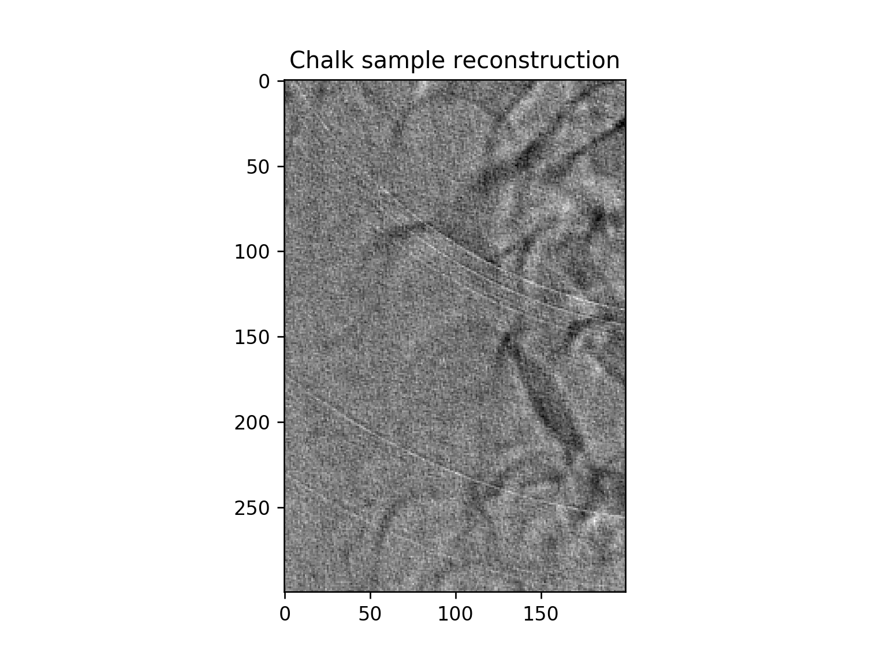
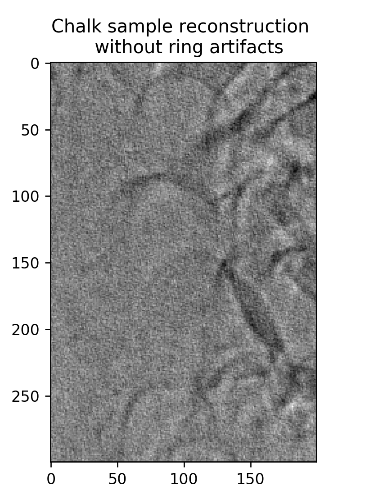
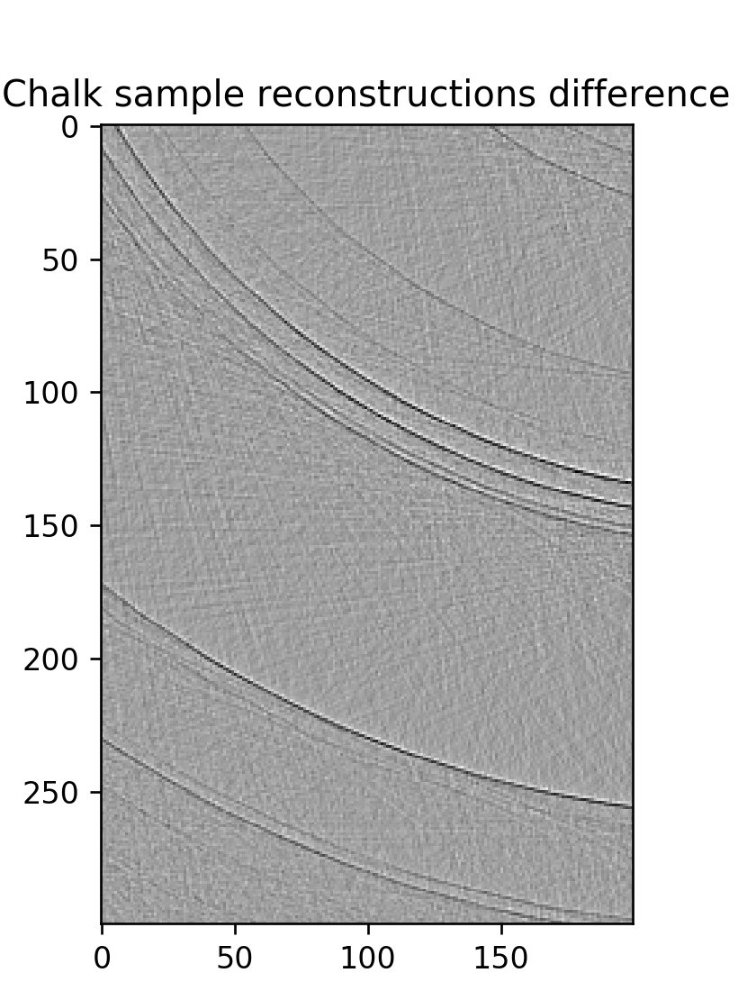

# RingArtifactRemover
A simple ring artifact remover for tomography

# Introduction
Ring artifacts in tomogram reconstructions are due to dead or damaged pixels on the detector used.
We purpose a simple but effective algorithm for remove these artifacts using the sinogram of the reconstructions 
based on median filters and thresholding.
The purpose is not to make the best ring removal but to show how intuative and easy the process can be while still
being a very effective tool, as seen in the Chalk sample image.

{width=30%} {width=30%} {width=30%}

# Algorithm
Using the Shepp-Logan image as a test bed 

Using the astra library the sinogram of the image can be found.
The sinogram is summed along the angle of projection axis to amplify the rings.
This sum as function of detector pixel is median filted and subtracted from the original summed sinogram.
This difference magnimagnify the ring artifacts, which now can be thresholded out.
To composate for the damage pixel it was found to be best to interpolate using nearest neighbour methods.
